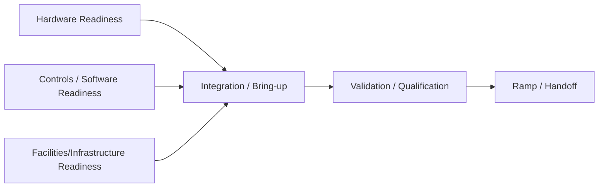

# NPI Program Playbook — Hardware + Controls + Facilities/Infrastructure

A **TPM/EPM-style execution repo** that demonstrates how to plan, run, and de-risk an NPI program across:
- **Hardware** (design, build, suppliers, FAT/SAT)
- **Controls/Software** (PLC/firmware/HMI, safety interlocks, versioning)
- **Facilities/Infrastructure ** (power, CDA, exhaust, network, EHS, permits, site readiness)

> This repository is intentionally **artifact-forward** (charter, WBS, IMS, RAID, change control, gates, weekly exec updates).  
> Use synthetic/anonymized data if you publish externally.

---

## Quick start

1) Start with the **Charter**: [`docs/charter/PROGRAM_CHARTER.md`](docs/charter/PROGRAM_CHARTER.md)  
2) Stand up governance: [`docs/governance/OPERATING_RHYTHM.md`](docs/governance/OPERATING_RHYTHM.md) + [`docs/governance/RACI.md`](docs/governance/RACI.md)  
3) Build your integrated plan:
- WBS: [`docs/plans/WBS.md`](docs/plans/WBS.md)
- IMS data: [`data/sample/ims_tasks.csv`](data/sample/ims_tasks.csv)
- Critical path: `python src/schedule/critical_path.py data/sample/ims_tasks.csv`

4) Run execution:
- RAID: [`docs/raids/RAID_LOG.md`](docs/raids/RAID_LOG.md)
- Change control: [`docs/raids/CHANGE_CONTROL.md`](docs/raids/CHANGE_CONTROL.md)
- Weekly exec update: [`docs/reports/WEEKLY_EXEC_UPDATE_TEMPLATE.md`](docs/reports/WEEKLY_EXEC_UPDATE_TEMPLATE.md)

---

## Execution Artifacts
- Weekly Exec Update: [`docs/reports/WEEKLY_EXEC_UPDATE_2026-01-01.md`](docs/reports/WEEKLY_EXEC_UPDATE_2026-01-01.md)
- Evidence: [`docs/evidence/critical_path_output.md`](docs/evidence/critical_path_output.md), [`docs/evidence/readiness_score_output.md`](docs/evidence/readiness_score_output.md)

---

## What “good” looks like (at a glance)

### Cross-domain dependency model
This repo treats the program as an integration of three readiness streams.



### Gate philosophy
Every gate has explicit **entry/exit criteria**, **owner**, and **evidence**.
- Gate definitions: [`docs/gates/GATE_MODEL.md`](docs/gates/GATE_MODEL.md)
- Gate checklists: [`docs/gates/checklists/`](docs/gates/checklists/)

---

## Repo map

```
docs/
  charter/
  governance/
  plans/
  gates/
  raids/
  reports/
  evidence/
data/
  sample/
src/
  schedule/
  metrics/
.github/
  ISSUE_TEMPLATE/
```
---
---

## 🤝 Contributing

This is a demonstration project for portfolio/interview purposes. If you'd like to extend it:

1. Fork the repository
2. Create a feature branch
3. Add enhancements (new models, visualizations, data sources)
4. Submit a pull request

---

## 📧 Contact

Let's connect! Whether you have a question or just want to say hi, feel free to reach out.

| Platform | Link |
| :--- | :--- |
| **👤 Name** | Sourabh Tarodekar |
| **✉️ Email** | [sourabh232@gmail.com](mailto:sourabh232@gmail.com) |
| **💼 LinkedIn** | [linkedin.com/in/sourabh232](https://www.linkedin.com/in/sourabh232) |
| **🚀 Portfolio** | [QuantuMaster007 Portfolio](https://github.com/QuantuMaster007/sourabh232.git) |

---

## 📄 License

MIT License - See LICENSE file for details

---
